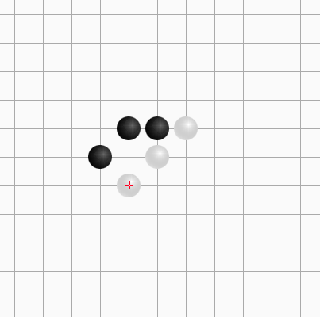
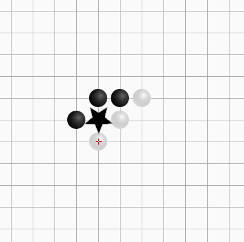

# AI-Platform

## 说明

这是五子棋AI大赛的服务器。

双方各提交一个cpp文件，使用`g++ --std=c++14 -O2 code.cpp -o ai.exe`编译。

棋盘大小为$11 * 11$，棋盘从上到下为行，从左到右为列，编号$0$到$10$。

首先，双方初始化，输出一行`init end`表示初始化结束。

之后每次输入一个局面，格式为：

```
player
chessboard
```

1. `player`表示当前的玩家是谁，`1`表示黑方，`2`表示白方
2. `chessboard`是一个11行11列的矩阵，`0`表示空白，`1`表示黑方，`2`表示白方

示例：已经进行了3回合，当前该黑方落子。

```
1
0 0 0 0 0 0 0 0 0 0 0
0 0 0 0 0 0 0 0 0 0 0
0 0 0 0 0 0 0 0 0 0 0
0 0 0 0 0 0 0 0 0 0 0
0 0 0 0 1 1 2 0 0 0 0
0 0 0 1 0 2 0 0 0 0 0
0 0 0 0 2 0 0 0 0 0 0
0 0 0 0 0 0 0 0 0 0 0
0 0 0 0 0 0 0 0 0 0 0
0 0 0 0 0 0 0 0 0 0 0
0 0 0 0 0 0 0 0 0 0 0
```

表示的局面如下：



AI应该读入该局面，输出落子位置(行和列)：

示例输出：
```
5 4
```

表示落子在5行4列，如图：



## 限制

0. 编译时间不能超过`10`秒
1. 初始化应该不超过`10`秒
2. 每个AI从读入局面到输出落子应该不超过`1`秒
3. 每个AI在落子之后到读入下一次局面之间不应该进行运算

## 输出

如果使用`cout`输出，那么最好使用`endl`换行。

如果使用`printf`输出，那么使用`\n`换行，并且在输出之后运行`fflush(stdout);`。

## 网站设计

1. 每个用户可以上传AI代码
2. 用户可以选择进行一次对局，进行对局会将用户的最新代码与其他用户的最新代码进行对战
3. 定时进行对战，定时对战会将所有用户的最新代码进行两两对战
4. 每次对战会进行两次，会交换先手和后手
5. 每次对局赢家得2分，输家不得分，平局各得1分，所以每次对局最多的4分
